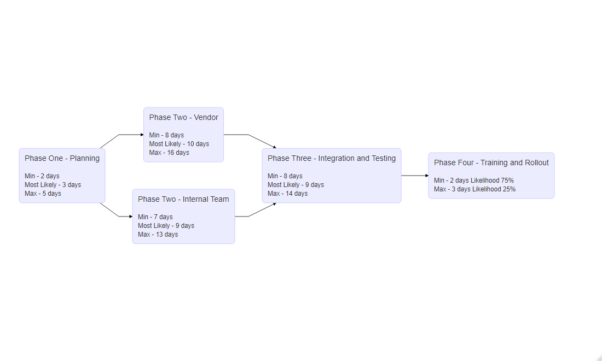

```{r setup, include=FALSE}
knitr::opts_chunk$set(echo = TRUE)
knitr::opts_chunk$set(tidy.opts=list(width.cutoff=60),tidy=TRUE)
```

### Libraries
```{r libs, warnings = FALSE, message = FALSE}

library(tidyverse)
library(DiagrammeR)
library(GoFKernel)
library(scales)
library(SimJoint)
library(Matrix)
library(knitr)
library(kableExtra)

```


# Project Simulation Using Monte Carlo

## Sequence Diagram

```{r sequence, results = 'asis'}

# Create sequence graph

mermaid("
graph LR
  A(Phase One - Planning<br><br><small>Min - 2 days<br>Most Likely - 3 days<br>Max - 5 days</small>)
  B(Phase Two - Vendor<br><br><small>Min - 8 days<br>Most Likely - 10 days<br>Max - 16 days</small>)
  C(Phase Two - Internal Team<br><br><small>Min - 7 days<br>Most Likely - 9 days<br>Max - 13 days</small>)
  D(Phase Three - Integration and Testing<br><br><small>Min - 8 days<br>Most Likely - 9 days<br>Max - 14 days</small>)
  E(Phase Four - Training and Rollout<br><br><small>Min - 2 days Likelihood  75%<br>Max - 3 days Likelihood  25%</small>)
  
  A-->B
  A-->C
  B-->D
  C-->D
  D-->E
  ")
```


The project progresses through four phases, notably, phase two has two tasks conducted in parallel and phase four as a two-point estimate with probabilities for either value.

## Simulation Using Triangular Distribution

Creating a data frame of the above values except phase four as it cannot be evaluated with a triangular distribution.

```{r}
# create data frame of tasks and times for the first 4 cases

task_durations <- data.frame(task = c("p1","p2v","p2i","p3"),
                             tmin = c(2,8,7,8),
                             tml = c(3,10,9,9),
                             tmax = c(5,16,13,14))

```

The algorithm simulates 1000 runs of the project. Each value is simulated independently with a new probability. The steps are:

1. The values for a task are read

2. A random probability is generated from a uniform distribution

3. The probability is used to calculate the time the task would take given the probability, using the inverse function for the triangle distribution.

4. Steps 3-4 are repeated for the simulation count, in this case 1000

5. Steps 1-5 are repeated for each task.

```{r}
## Monte Carlo Simulation with Triangle Distribution

# inverse triangle function

inv_triangle_cdf <- function(P, vmin, vml, vmax){

  Pvml <- (vml-vmin)/(vmax-vmin)
  
  return(ifelse(P < Pvml,
                vmin + sqrt(P*(vml-vmin)*(vmax-vmin)),
                vmax - sqrt((1-P)*(vmax-vml)*(vmax-vmin))))
}

# number of trials

n=1000

set.seed(98)

# trials df

tsim <- as.data.frame(matrix(nrow=n,ncol=nrow(task_durations)+1))

# for each task
for (i in 1:nrow(task_durations)){
  #set task durations
  vmin <- task_durations$tmin[i]
  vml <- task_durations$tml[i]
  vmax <- task_durations$tmax[i]
  
  #generate n random numbers (one per trial)
  psim <- runif(n)
  #simulate n instances of task
  tsim[,i] <- inv_triangle_cdf(psim,vmin,vml,vmax) 
}

```

Phase 4 requires a different simulation method for the two-point estimate, details available in Appendix A. 

```{r}
# calc phase 4, likelihood of being completed in 2 days 0.75 in 3 days 0.25
# Very naive, no interpolated distribution 

# generate random probabilities in uniform distribution
tsim[,5] <- runif(nrow(tsim))

# if less than 25% probability time taken is 3, if not 3 time taken is 2
tsim[tsim[,5] < 0.25, 5] <- 3
tsim[tsim[,5] != 3, 5] <- 2

#sum costs for each trial
ttot <- tsim[,1] + pmax(tsim[,2], tsim[,3]) + tsim[,4] + tsim[,5]
```

To create an overall estimate for the project timeframe, the total time for each simulation is calculated. By taking the parallel max of the two simultaneous phase two tasks, whichever task has run longer is taken to be the time of that phase.

# Improvements

## Implement PERT Distribution

The PERT distribution is a form of beta distribution that increases the "normality" from a three-point estimate over a triangular distribution by creating a bell distribution rather than a straight slope from most likely increasing emphasis on the value. The curvature or kurtosis of this distribution is controlled through the additional lambda value, a value of 4 being the default 'normal' distribution, higher values place greater emphasis on time most likely. The process is otherwise the same.

```{r}
# https://www.riskamp.com/beta-pert

rpert <- function( n, x.min, x.max, x.mode, lambda = 4 ){

    if( x.min > x.max || x.mode > x.max || x.mode < x.min ) stop( "invalid parameters" );

    x.range <- x.max - x.min;
    if( x.range == 0 ) return( rep( x.min, n ));

    mu <- ( x.min + x.max + lambda * x.mode ) / ( lambda + 2 );

    # special case if mu == mode
    if( mu == x.mode ){
        v <- ( lambda / 2 ) + 1
    }
    else {
        v <- (( mu - x.min ) * ( 2 * x.mode - x.min - x.max )) /
            (( x.mode - mu ) * ( x.max - x.min ));
    }

    w <- ( v * ( x.max - mu )) / ( mu - x.min );
    return ( rbeta( n, v, w ) * x.range + x.min );
}

# number of trials

n=1000

set.seed(98)

# trials df

tsimp <- as.data.frame(matrix(nrow=n,ncol=nrow(task_durations)+1))

# for each task
for (i in 1:nrow(task_durations)){
  #set task durations
  vmin <- task_durations$tmin[i]
  vml <- task_durations$tml[i]
  vmax <- task_durations$tmax[i]
  
  #simulate n instances of task with rpert
  tsimp[,i] <- rpert(n,vmin,vmax,vml, lambda = 4) 
}

```

## Improve phase 4 distribution PERT-like

```{r}
# calc phase 4, likelihood of being completed in 2 days 0.75 in 3 days 0.25

# Use rpert to generate a standard distribution
tsimp[,5] <- rpert(nrow(tsimp), 0, 1, 0.5, lambda = 4)

# calculate the value associated with 75% likelihood of completion by that value
sfq <- quantile(ecdf(tsimp[,5]),0.75,type=7)

# all values below previous value are converted to 2 days to complete
tsimp[tsimp[,5] <= sfq, 5] <- 2

# remaining values are scaled between 2 and 3 maintaining existing distribution
tsimp[tsimp[,5] != 2, 5] <- rescale(tsimp[tsimp[,5] != 2, 5], to = c(2:3))
plot(ecdf(tsimp[,5]))

# sum costs for each trial
ttotp <- tsimp[,1] + pmax(tsimp[,2], tsimp[,3]) + tsimp[,4] + tsimp[,5]

```

An attempt was made to introduce a PERT-like distribution into the values of phase four, essentially taking the form of the upper quarter of a binomial CDF. Further detail and potential alternative method can be found in Appendix A.

## Late-Later Correlation

```{r, message = FALSE, warning = FALSE, results= 'hide'}

# Correlation between PERT distributed tasks
cor(tsimp)

# set seed value for reproducibility
set.seed(98)

# create a matrix 'number of tasks' x 'number of tasks', each value is a random number between 0.4 and 0.6
cormat <- matrix(runif(25, min = 0.4, max = 0.6), nrow = 5, ncol = 5)

#make the diagonal values equal to 1
for (i in 1:nrow(cormat)) {
cormat[i,i] <- 1
}

# mirror upper half onto lower haf of matrix
cormat <- as.matrix(forceSymmetric(cormat))

# correlation matrix to be imposed
cormat

# copy simulated values from pert simulation
tsimcor <- tsimp

# package requires ordered input values
tsimcor <- tsimcor %>% 
  map_df(sort) %>% 
  as.matrix()

# impose correlation matrix on data by reordering variables
tsimcor <- SJpearson(tsimcor, cormat, verbose = FALSE)$X

# convert to dataframe
tsimcor <- as.data.frame(tsimcor)

# test correlation of new data
cor(tsimcor)

#plot correlation
pairs(tsimcor)

#sum costs for each trial
ttotcor <- tsimcor[,1] + pmax(tsimcor[,2], tsimcor[,3]) + tsimcor[,4] + tsimcor[,5]
```

To evaluate the effect of late projects becoming later, correlation between values was introduced into the simulation. An initial literature review did not produce a 'standard' value for correlation between project tasks. As an example, an arbitrary range between 0.4 - 0.6 Pearson correlation value was chosen, and values randomly generated from a uniform distribution within this range between the different tasks. The simulation data was then reordered to represent the given correlation using the SimJoint package implementation of the Iman-Conover method. In real use, it would be beneficial to conduct some form of analysis, either quantitative such as utilising historical data, or qualitative such as pair-wise comparison to create the correlation matrix.

# Outputs

## 2.b. Project Probability Distribution Curves

```{r, fig.width= 8, fig.align="centre"}

pdfc <- data.frame(Triangular_Distribution = ttot, PERT_Distribution = ttotp, PERT_Correlated_Distribution = ttotcor)

ggplot(pdfc) + geom_density(aes(x = Triangular_Distribution, color = "blue"), size = 1, alpha = 0.8) +
  geom_density(aes(x = PERT_Distribution, color = "green"), size = 1, alpha = 0.8) +
  geom_density(aes(x = PERT_Correlated_Distribution, color = "red"), size = 1, alpha = 0.8) +
  xlab("Time") +
  ylab("probability p(t)") +
  scale_colour_manual(name = 'Distributions',
         values =c('blue'='blue', "green" = "green", 'red'='red'),
         labels = c('Triangular_Distribution', 'PERT_Distribution', 'PERT_Correlated_Distribution'))

```

## 2.c. Project Cumulative Probability Distribution Curves

```{r, fig.width= 8, fig.align="centre"}
ggplot(pdfc) + stat_ecdf(aes(x = Triangular_Distribution, color = "blue"), size = 1, alpha = 0.8) +
  stat_ecdf(aes(x = PERT_Distribution, color = "green"), size = 1, alpha = 0.8) +
  stat_ecdf(aes(x = PERT_Correlated_Distribution, color = "red"), size = 1, alpha = 0.8) +
  xlab("Time") +
  ylab("Cumultive Probability P(t)") +
  scale_colour_manual(name = 'Distributions',
         values =c('blue'='blue', "green" = "green", 'red'='red'),
         labels = c('Triangular_Distribution', 'PERT_Distribution', 'PERT_Correlated_Distribution'))
```

Analysis of the above plots and additional overlaid plots is available in Appendix B.

## 3. Which Curve

In order to estimate the likelihood a task is completed by a given time, estimation is made using the CDF curve, as this indicates the sum of probabilities the task has been completed in all lower time intervals up to the estimate. The PDF curve would indicate the likelihood of the task being completed at that specific time, which is less informative in project planning. Utilising monte carlo and the CDF curve enables the selection of an acceptable amount of risk in planning the timeline.

## 4. Likelihood of Completion Within 27 Days
```{r}

# print probability outputs at time value on ECDF, prints as percentage

paste("Triangular_Distribution - ", (ecdf(ttot)(27))*100, "%")
paste("PERT_Distribution - ", (ecdf(ttotp)(27))*100, "%")
paste("PERT_Correlated_Distribution - ", (ecdf(ttotcor)(27))*100, "%")
```

The different values for completion within 27 days are a result of the most likely estimation times. The shift toward earlier completion in the PERT distribution is visible here.

## 5. 90% Likely Completion Time
```{r}

# prints time value at given quantile of probability. Using default type 7, continuous sample. Prints as days

paste("Triangular_Distribution - ", signif(quantile(ecdf(ttot),0.9,type=7), 4), "days")
paste("PERT_Distribution - ", signif(quantile(ecdf(ttotp),0.9,type=7), 4), "days")
paste("PERT_Correlated_Distribution - ", signif(quantile(ecdf(ttotcor),0.9,type=7), 4), "days")
```

Despite the significant increase in completion probability with PERT at 27 days, completion time for a given probability / risk level is around 7.5% earlier due to the binomial distribution. Showing, at the upper and lower bounds the differences between distribution selection is less pronounced. Accurate distribution and estimation, while beneficial to all models, will have the greatest benefit at higher levels or risk, therefore when planning projects around lower probabilities of completion by a given time.

## 6.a. Rational

Monte Carlo simulation provides a method of simulating the probability of completeing a given task at a specific time, given a distribution. In the case of projects with many tasks, in order to understand the distribution of the probability that a project will be complete at a given time. We use this methodology to simulate each tasks individually, and then sum them together as a singular simulation of the full project. A distribution of completion times for the full project can then be calculate from the simulated outcomes.

## 6.b. Assumptions Made
* The distribution of the actual time taken for a task based off a three point estimate falls within a triangular distribution or PERT distribution
* The initial triangular and PERT methods assumed all tasks were independent of one another
* The correlated simulation assumed a correlation between all tasks of 0.4-0.6
* Tasks cannot end before Tmin or after Tmax
* The estimations have some validity, if estimations are completely inaccurate the model will also be completely inaccurate
* Parallel tasks will be completed in parallel
* We are more likely looking to define a suitable risk level for project timeline rather than a completion date
* We have no additional information about each task
* Outside factors are unaccounted for / do not influence the project beyond the given distribution

## 7. Late Projects Become Later
To impose the effect of projects running long of deadlines on prior tasks increasing the likelihood the project will run long on later tasks depends on what assumptions we make as to why the tasks are running later. Some potential assumptions as to why the project is running over estimated values are (More detail can be found in Appendix C):

* Inaccurate / low estimation
* Importance of tasks / Effect of other projects
* Uncertainty / unforeseen delays
* Miss timed tasks / resources

Some options are suggested in the table below for implementing measures that would realise these assumptions in outputs. Their usefulness and effectiveness is impacted by the availability of prior data on individual's estimates, project predictions vs actual timeline, where the current project is along it's own timeline. 

Estimates can be improved initially by utilising historical data and weighting historical information by accuracy and similarity to current project and/or team, though this does not address implementing adage.


```{r, echo = FALSE, message=FALSE, warning=FALSE}
latelate <- tibble(matrix(nrow = 3, ncol = 4))
names(latelate) <- c("Option", "Description", "Assumptions_Addressed", "Limitations")
latelate$Option <- c("Correlation", "Bayesian Inference", "Penalty value")

cordesc <- "Correlation, as demonstrated in the PERT-Correlated simulation can be used to reorder the values, while maintaining their distributions, such that the tasks are correlated. By doing so tasks at the higher end of run time for that task, are more likely to be grouped with other tasks that are similarly located toward Tmax"
  
bayesdesc <- "Bayesian Inference can be utilised to revise estimates based on historical data, or ongoing project performance. This enables testing, improvement, and re-simulation of the project. As longer run times are identified, this method can identify if future tasks also need updating, and potential improvements.<br><br>
An advantage over correlation is that this method can increase or decrease the estimated values. This can cope with a wider scope of time differences. This can also account for the effect of variation in influence between tasks."
  
pendesc <- "A late run penalty value can be added to subsequent tasks based on the performance of previous tasks. This can be a constant value, or scale with the outcome time of previous tasks. This can be implemented during initial planning, to simulate the compounding effect of lateness, or as the project progresses based on actual performance.<br><br>
This method is less realistic than other methods, though simpler to implement."

latelate$Description <- c(cordesc, bayesdesc, pendesc)


coraa <- "Consistent underestimation means that all tasks run into or over higher estimates. <br><br>
If the importance of the project overall is reduced this method reflects this. <br><br>
Uncertainty is accounted for as long as it is relatively consistent across the project. <br><br>
Similarly, miss timing causing overrun is accounted for if consistent. <br><br>
By correlating the simulated values that ran higher into the estimation are more likely to be in grouped / in the same simulation. This offsets high probability completion times higher to Tmax."
  
bayesaa <- "Bayesian inference can address all assumptions. Though the many potential conditional probabilities would be complex."
  
penaa <- "Low estimation can be offset by the penalty value. Though it may not compound as expected depending on the penalty in proportion to the full run time of the subsequent task.<br><br>
Changing importance requires a more complex penalty.<br><br>
This would address miss timing, but only within the bounds of the penalty."

latelate$Assumptions_Addressed <- c(coraa, bayesaa, penaa) 


corlim <- "If project priority is changing or sporadic, this is not represented. Though may result in similar outcomes.<br><br>
This method assumes a consistent effect of uncertainty across tasks. If uncertainty is changing or compounding it is not necessarily accounted for.<br><br>
Minimal or no movement in Tmin and Tmax. Correlation has a maximum amount that the overall timeline can be shortened by. From total Tmin to total Tmax. This may already be represented in the simulation. Meaning when challenges cause overrun they are not accounted for."
  
bayeslim <- "Implementing Bayesian inference effect on subsequent simulated outcomes to cope with late-later will lead to unreliable distributions. It may be more useful to review initial estimates. utilising historic data and Bayesian Inference.<br><br>
If the assumption that the project will be completed by Tmax is held. Late running tasks early in the project will cause the probability of subsequent tasks running late reduce."
  
penlim <- "A penalty value would be unlikely to address variable levels of uncertainty.<br><br>
During the project, it is likely better to utilise Bayesian Inference rather than a penalty value based on task outcomes.."

latelate$Limitations <- c(corlim, bayeslim, penlim) 
```


```{r, echo = FALSE, results = 'asis'}
kable_styling(kable(latelate[1:3,], caption = "Table of Options", format = "html", escape = FALSE))
```


# Appendix

## Appendix A - Phase Four Distributions

### Initial Method

This method draws a random probability from a uniform distribution, if the probability is lower than 0.25, the task is taken to be completed in 3 hours, all other are values are taken to have been completed in 2 hours. Representing the 75%|25% split as the probabilities add to 100%.

### PERT-Like Method

First generating a Lambda 4 distribution between 0 and 1, then, finding the value indicating 75% likelihood of completion. All values below this value were then assigned a value of 2. The remaining values were then rescaled, maintaining their distribution, between 2 and 3. This maintains the 75% chance of completion in 2 days as indicated, and the total 100% chance of completion by 3 days. This distribution also maintains Tmin = 2 and Tmax = 3.

### PERT-Like Alternative

An alternative, to create an improved distribution between 2 and its near values would be to utilise one of the assumptions of the three-point distributions. By using a Tmin value slightly below the true Tmin, and utilising a Tml of 2, modulating the lambda value until 75% likelihood of completion falls as close to 2 as possible. Though this violates the Tmin and Tmax given.

## Appendix B - Plot Analysis

### PDF

```{r, fig.width= 8, fig.align="centre"}

pdfc <- data.frame(Triangular_Distribution = ttot, PERT_Distribution = ttotp, PERT_Correlated_Distribution = ttotcor)

ggplot(pdfc) + geom_density(aes(x = Triangular_Distribution, color = "blue"), size = 1, alpha = 0.8) +
  geom_density(aes(x = PERT_Distribution, color = "green"), size = 1, alpha = 0.8) +
  geom_density(aes(x = PERT_Correlated_Distribution, color = "red"), size = 1, alpha = 0.8) +
  xlab("Time") +
  ylab("probability p(t)") +
  scale_colour_manual(name = 'Distributions',
         values =c('blue'='blue', "green" = "green", 'red'='red'),
         labels = c('Triangular_Distribution', 'PERT_Distribution', 'PERT_Correlated_Distribution'))

```

The above figure shows the different PDF curves for each iteration of the simulation. Implementing PERT distribution shifts the total completion time left. The shift reflecting that the most likely estimates for each task were closer to Tmin values than Tmax values for this simulation. Inducing correlation on the PERT distribution to simulate late-later effect increased the height of the right tail of the distribution above PERT while increasing the left shift, the correlation method also introduced an assumption that for late projects to run later, early projects must run earlier.

All distributions have a slight bump above 30 hours, investigation shows this is an effect of the parallelisation of tasks in phase two. This may indicate an opportunity to investigate, re-estimate or optimise the process around these tasks, particularly if the project begins to run long.


### CDF

```{r, fig.width= 8, fig.align="centre"}
ggplot(pdfc) + stat_ecdf(aes(x = Triangular_Distribution, color = "blue"), size = 1, alpha = 0.8) +
  stat_ecdf(aes(x = PERT_Distribution, color = "green"), size = 1, alpha = 0.8) +
  stat_ecdf(aes(x = PERT_Correlated_Distribution, color = "red"), size = 1, alpha = 0.8) +
  xlab("Time") +
  ylab("Cumultive Probability P(t)") +
  scale_colour_manual(name = 'Distributions',
         values =c('blue'='blue', "green" = "green", 'red'='red'),
         labels = c('Triangular_Distribution', 'PERT_Distribution', 'PERT_Correlated_Distribution'))
```

The increased slope of the PERT distribution reflects the increased weight of the most-likely estimate. This distribution would be beneficial with reliable estimators, however in the case of inaccurate estimates for most likely completion time it would be detrimental.

### Overlaid PDF

```{r}
overlay <- data.frame(Triangular_Distribution = ttot, PERT_Distribution = ttotp, PERT_Correlated_Distribution = ttotcor)

for (i in 1:ncol(overlay)) {
  overlay[,i] <- rescale(overlay[,i])
}

ggplot(overlay) + geom_density(aes(x = Triangular_Distribution, color = "blue"), size = 1, alpha = 0.8) +
  geom_density(aes(x = PERT_Distribution, color = "green"), size = 1, alpha = 0.8) +
  geom_density(aes(x = PERT_Correlated_Distribution, color = "red"), size = 1, alpha = 0.8) +
  xlab("Time") +
  ylab("probability p(t)") +
  scale_colour_manual(name = 'Distributions',
         values =c('blue'='blue', "green" = "green", 'red'='red'),
         labels = c('Triangular_Distribution', 'PERT_Distribution', 'PERT_Correlated_Distribution'))
```
Interestingly, when overlaying the distributions, despite being drawn from the PERT distribution, the correlated tail is of a similar shape to the Triangular distribution.

### Overlaid CDF

```{r}
ggplot(overlay) + stat_ecdf(aes(x = Triangular_Distribution, color = "blue"), size = 1, alpha = 0.8) +
  stat_ecdf(aes(x = PERT_Distribution, color = "green"), size = 1, alpha = 0.8) +
  stat_ecdf(aes(x = PERT_Correlated_Distribution, color = "red"), size = 1, alpha = 0.8) +
  xlab("Time") +
  ylab("Cumultive Probability P(t)") +
  scale_colour_manual(name = 'Distributions',
         values =c('blue'='blue', "green" = "green", 'red'='red'),
         labels = c('Triangular_Distribution', 'PERT_Distribution', 'PERT_Correlated_Distribution'))
```

Overlaying the distributions shows that inducing correlation creates distribution similar to that of the Triangular distribution. This is not obvious in the previous plots as the correlated values maintain the left shift of the initial PERT estimation. Potentially due to the deemphasis of the most likely estimate.

## Appendix C - Project Delay

### Assumptions

* Inaccurate / low estimation - The most often blamed cause, an estimator may be bias in their estimates toward a shorter timeframe due to a variety of internal and external factors. Such as, incorrect estimation of ability, or pressure from managers to shorted deadlines.

* Importance of tasks / Effect of other projects – When planning a project, it is often high on the list of priorities for those estimating the timeline and/or working on the project. As the project progresses, other projects may begin, older projects may be delayed and pull resources away from the estimated project. This change in priority weight can be compounded as delayed projects can loose priority in the ecosystem.

* Uncertainty / unforeseen delays – Both the first two options address particular challenges creating uncertainty in estimation. Many delays and unforeseen uncertainties that can delay a project, can continue to or compound delays as the project progresses

* Miss timed tasks / resources - Project estimates are influenced by resource availability. When planning a project, resources are made available at the estimated time. A prior task running over time can move later tasks outside the availability timeframe inducing further delay.

